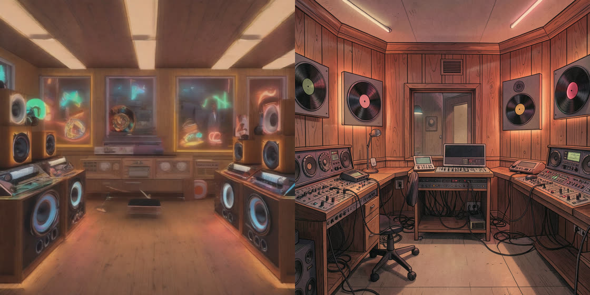

# diffuseR

[](https://CRAN.R-project.org/package=diffuseR)
[](https://lifecycle.r-lib.org/articles/stages.html#experimental)

## Overview

`diffuseR` is a functional R implementation of diffusion models, inspired by Hugging Face's Python `diffusers` library. The package provides a simple, idiomatic R interface to state-of-the-art generative AI models for image generation and manipulation using base R and the `torch` package. No Python dependencies. Currently supports Windows and Linux cpu and cuda devices.

## Example output



## Installation

First install torch. As per [this comment](https://github.com/mlverse/torch/issues/1198#issuecomment-2419363312), using the pre-built binaries from [https://torch.mlverse.org/docs/articles/installation#pre-built](https://torch.mlverse.org/docs/articles/installation#pre-built) is heavily recommend. "The pre-built binaries bundle the necessary CUDA and cudnn versions, so you don't need a global compatible system version of CUDA":

```r
options(timeout = 600) # increasing timeout is recommended since we will be downloading a 2GB file.
# For Windows and Linux: "cpu", "cu128" are the only currently supported
# For MacOS the supported are: "cpu-intel" or "cpu-m1"
kind <- "cu124"
version <- available.packages()["torch","Version"]
options(repos = c(
  torch = sprintf("https://torch-cdn.mlverse.org/packages/%s/%s/", kind, version),
  CRAN = "https://cloud.r-project.org" # or any other from which you want to install the other R dependencies.
))
install.packages("torch")
```

You can install the development version of diffuseR from GitHub:

```r
# install.packages("devtools")
devtools::install_github("cornball-ai/diffuseR")
# Or
# install.packages("targets")
targets::install_github("cornball-ai/diffuseR")
```

## Features

- **Text-to-Image Generation**: Stable Diffusion 2.1, SDXL, FLUX.1-schnell, FLUX.2 Klein, and Z-Image-Turbo (fully native R torch implementations)
- **Text-to-Video Generation**: LTX-2.3 with synchronized audio
- **Image-to-Image Generation**: Modify existing images based on text prompts (SD 2.1 / SDXL)
- **GPU-poor support**: NF4 and fp8 quantization run the 12B FLUX.1 and 22B LTX-2.3 transformers on a 16GB card
- **Scheduler Options**: DDIM and FlowMatch Euler (static and dynamic shifting)
- **Device Support**: CPU and CUDA GPUs (including Blackwell RTX 50xx)
- **R-native Interface**: Functional programming approach that feels natural in R

## Hardware requirements

Approximate, per model, from the floor configuration (lowest precision,
CPU-only) to the best-quality tier. `recommend("model")` picks the right
configuration for your machine automatically; the `vignette("performance-levers")`
explains the levers.

| model | minimum (floor quality) | best quality |
|---|---|---|
| SD 2.1 | 4 GB RAM, no GPU | 6 GB VRAM + 4 GB RAM (fp16) |
| SDXL | 10 GB RAM, no GPU | 12 GB VRAM + 8 GB RAM (fp16) |
| FLUX.2 Klein | 12 GB RAM, no GPU | 16 GB VRAM + 20 GB RAM (bf16) |
| Z-Image-Turbo | 14 GB RAM, no GPU | 18 GB VRAM + 24 GB RAM (bf16) |
| FLUX.1-schnell | 28 GB RAM, no GPU | 24 GB VRAM + 45 GB RAM (bf16) |
| LTX-2.3 video | 40 GB RAM, no GPU | 16 GB VRAM + 45 GB RAM (fp8, streamed) |

## Quick Start

### Basic Usage

**Warning**: The first time you run the code below, it will download ~5.3GB of Stable Diffusion 2.1 CPU-only model files [from Hugging Face](https://huggingface.co/datasets/cornball-ai/sd21-R/tree/main) and load them into memory. Ensure you have enough RAM, disk space, and a stable internet connection. Memory management with deep learning models is crucial, so consider using a machine with sufficient resources; ~8GB of free RAM is recommended for running Stable Diffusion 2.1 on CPU only.

```r
options(timeout = 600) # increasing timeout is recommended since we will be downloading a 3.5GB file.
library(diffuseR)
torch::local_no_grad()

# Generate an image from text
cat_img <- txt2img(
  prompt = "a photorealistic cat wearing sunglasses",
  model = "sd21", # Specify the model to use, e.g., "sd21" for Stable Diffusion 2.1
  download_models = TRUE, # Automatically download the model if not already present
  steps = 30,
  seed = 42,
  filename = "cat.png",
)

# Clear out pipeline to free up GPU memory
pipeline <- NULL
torch::cuda_empty_cache()
```


### Advanced Usage with GPU

The unet is the most computationally-intensive part of the model, so it is recommended to run it on a GPU if possible. The decoder and text encoder can be run on CPU if you have limited GPU memory. SDXL's unet requires a minimum of 6GB of GPU memory (VRAM), while Stable Diffusion 2.1 requires a minimum of 2GB.

```r
# Increasing timeout is recommended since we will be downloading 5.1 and 2.8GB model files, among others.
options(timeout = 1200) 

library(diffuseR)
torch::local_no_grad() # Prevents torch from tracking gradients, which is not needed for inference

# Assign the various deep learning models to devices
model_name = "sdxl"
devices = list(unet = "cuda", decoder = "cpu",
               text_encoder = "cpu", encoder = "cpu")

m2d <- models2devices(model_name = model_name, devices = devices,
                      unet_dtype_str = "float16", download_models = TRUE)

pipeline <- load_pipeline(model_name = model_name, m2d = m2d, i2i = TRUE,
                          unet_dtype_str = "float16")

# Generate an image from text
cat_img <- txt2img(
  prompt = "a photorealistic cat wearing sunglasses",
  model_name = model_name,
  devices = devices,
  pipeline = pipeline,
  num_inference_steps = 30,
  guidance_scale = 7.5,
  seed = 42,
  filename = "cat2.png",
)

gambling_cat <- img2img(
  input_image = "cat2.png",
  prompt = "a photorealistic cat throwing dice",
  img_dim = 1024,
  model_name = model_name,
  devices = devices,
  pipeline = pipeline,
  num_inference_steps = 30,
  strength = 0.75,
  guidance_scale = 7.5,
  seed = 42,
  filename = "gambling_cat.png"
)

# Clear out pipeline to free up GPU memory
pipeline <- NULL
torch::cuda_empty_cache()
```


### FLUX and Z-Image

FLUX.1-schnell (12B), FLUX.2 Klein (4B), and Z-Image-Turbo (6B) are
step-distilled models: 4-8 denoising steps, no guidance. All are
quantized locally once at download time and fit comfortably on a 16GB
GPU (measured 1024x1024 on an RTX 5060 Ti: FLUX.1 ~55s at 9.6GB peak;
FLUX.2 Klein ~13s at 12.5GB; Z-Image-Turbo ~24s at 13.1GB).

```r
library(diffuseR)

# FLUX.1-schnell: the HuggingFace repo is gated (Apache-2.0 weights,
# license click-through). Accept the license and set HF_TOKEN first.
# ~34GB download, one-time NF4 quantize to a 6.8GB artifact.
download_flux1()
txt2img_flux("An astronaut riding a horse on Mars, photorealistic",
             seed = 7)

# FLUX.2 Klein 4B: ungated. ~16GB download, one-time fp8 quantize to
# a 3.9GB artifact.
download_flux2_klein()
txt2img_flux2("a red fox sitting in a snowy forest, digital art",
              seed = 42)

# Z-Image-Turbo: ungated, strong at legible text in images (EN + CN).
# ~33GB download, one-time fp8 quantize to a 5.9GB artifact.
download_zimage_turbo()
txt2img_zimage(paste("A storefront with a large wooden sign that reads",
                     "\"DIFFUSER\" in bold carved letters"), seed = 42)

# Or through the common dispatcher
txt2img("a lighthouse at dusk", model_name = "flux2")
```

### Precision and safetensors

The quantized transformers ship as **nf4** by default (packed uint8 +
float32 blocks). nf4 loads on **stock CRAN safetensors** because the
artifacts are written in sub-2 GB shards; R's safetensors overflows a
32-bit offset on any single file at or above 2^31 bytes (~2.15 GB), so
shard size, not the dtype, is what gates readability.

Higher-quality tiers behave as follows:

- **bf16** (24 GB+ cards) is also CRAN-readable.
- **fp8** (the 12-16 GB sweet spot) needs the
  [`cornball-ai/safetensors`](https://github.com/cornball-ai/safetensors)
  fork until float8 support lands on CRAN (mlverse/safetensors#13).

`recommend(model)` picks the right tier for your VRAM and the
safetensors you have installed, and asking for a tier your safetensors
cannot read falls back to nf4 with a note rather than erroring:

```r
recommend("flux2")            # e.g. list(precision = "fp8", ...) on a 16 GB card
recommend("flux1")$note       # the fork suggestion, when fp8/bf16 would fit but can't load
```

## Supported Models

Currently supported models:

- Stable Diffusion 2.1
- Stable Diffusion XL (SDXL)
- FLUX.1-schnell (12B, 4-step distilled)
- FLUX.2 Klein 4B (4-step distilled)
- Z-Image-Turbo (6B, 8-step distilled, text rendering)
- LTX-2.3 Video (with audio)

### Choosing an image model: SDXL vs FLUX.2

Same prompt, same seed, 1024x1024, measured on an RTX 5060 Ti 16GB:

> "A retro 1970s radio station studio interior, warm wood panels,
> vinyl records on the walls, soft neon glow, detailed illustration"

| Model | Settings | Load | Warm generation | Peak VRAM |
|---|---|---|---|---|
| SDXL | 50 steps, CFG 7.5 | 45 s | 20 s | **12.7 GB** |
| FLUX.2 Klein 4B | 4 steps, guidance-free | 32 s | **13 s** | 12.5 GB |

FLUX.2 is now faster per image (since the allocator gc-gate fix), and
its prompt adherence and coherence are in a different class — SDXL
melts the speaker stacks and turns the wall records into neon smears,
while FLUX.2 draws the studio you asked for (SDXL left, FLUX.2 right):


Rule of thumb: reach for FLUX.2. Note FLUX.2 Klein is guidance-free,
so negative prompts do not apply. When the image needs legible text
(signs, posters, labels), reach for Z-Image-Turbo instead.

### Downloading Models

Models are automatically downloaded from HuggingFace on first use. For gated models (like FLUX.1-schnell), you need to:

1. Create a HuggingFace account at https://huggingface.co
2. Accept the model's license agreement (visit the model page and click "Agree")
3. Create an access token at https://huggingface.co/settings/tokens
4. Add to your `~/.Renviron`:
   ```
   HF_TOKEN=hf_your_token_here
   ```

**Manual download with hfhub:**

```r
# Install hfhub with HF_TOKEN fix (until PR merged upstream)
remotes::install_github("cornball-ai/hfhub@fix-gated-repos")

# Download a model
library(hfhub)
path <- hub_download("google/gemma-3-12b-it", "config.json")
# Or download entire model:
# path <- hub_snapshot("stabilityai/stable-diffusion-2-1")
```

## Roadmap

Future plans for diffuseR include:

- [ ] Inpainting support
- [ ] Additional schedulers (PNDM, DPMSolverMultistep, Euler ancestral)
- [ ] FLUX.2 reference-image conditioning and img2img
- [x] text-to-video generation (LTX-2.3)

## How It Works

diffuseR supports two execution modes:

**Native R torch (recommended for SDXL)**: Pure R implementations of VAE decoder, text encoders, and UNet. Required for Blackwell GPUs (RTX 50xx series) and recommended for best compatibility. Enable with `use_native_*` flags or use `txt2img_sdxl()` which defaults to native.

**TorchScript (legacy)**: Pre-exported models from PyTorch. Still available for SD21 and older GPUs. Scripts to build TorchScript files are at [diffuseR-TS](https://github.com/cornball-ai/diffuseR-TS/).

No Python dependencies required for either mode.

## Contributing

Contributions are welcome! Please feel free to submit a Pull Request.

## License

This project is licensed under the Apache 2. License - see the LICENSE file for details.

## Acknowledgments

- Hugging Face for the original diffusers library
- Stability AI for Stable Diffusion
- The R and torch communities for their excellent tooling
